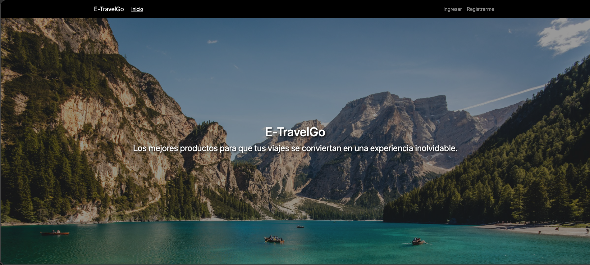
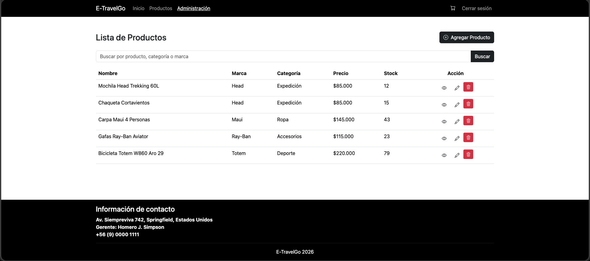
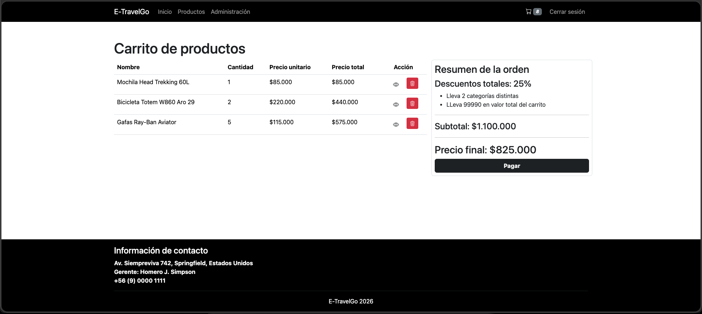

# ecommerce-m6

Link del repositorio: https://github.com/gNOR-mu/ecommerce-m7

# Propósito

Entregar la versión final del proyecto integrando lo construido en módulos previos y
publicándolo como producto de portafolio en GitHub: app funcionando, documentación
clara e instrucciones de ejecución local.

# Consideraciones

- Se utiliza MySQL
- Nombre de la base de datos: etravelgo
- Usuario db: root (cambiar si es necesario)
- Pass db: Root1234* (cambiar si es necesario)
- Para las vistas se ha utilizado Thymeleaf con: spring.thymeleaf.cache=false

Configuración del [application.properties](src/main/resources/application.properties):

```
spring.datasource.url =jdbc:mysql://localhost:3306/etravelgo
spring.datasource.username=root
spring.datasource.password=Root1234*
spring.datasource.driver-class-name=com.mysql.cj.jdbc.Driver
spring.jpa.hibernate.ddl-auto=update
```

# Compilación y ejecución

- Ejecutar con maven: ```mvn spring-boot:run```

- Construir JAR: ```mvn clean package```
- Ejecutar JAR: ```java -jar target/mvp_m6-0.0.1-SNAPSHOT.jar```

# Descripción de rutas

Tomando en cuenta que se ejecuta en el equipo local y puerto 8080 con ruta base http://localhost:8080/:

| URL                                       | DESCRIPCIÓN                                                                               | Restringido             |
|-------------------------------------------|-------------------------------------------------------------------------------------------|-------------------------|
| http://localhost:8080/                    | Página de inicio                                                                          | No                      |
| http://localhost:8080/login               | Página de inicio de sesión                                                                | No                      |
| http://localhost:8080/signup              | Página de registro de usuario                                                             | No                      |
| http://localhost:8080/                    | Página de inicio                                                                          | No                      |
| http://localhost:8080/products            | Página de todos los productos para el consumidor                                          | Sí (solo ADMIN, CLIENT) |
| http://localhost:8080/products/1          | Página de un producto en particular (id = 1), en donde el 1 corresponde a un PathVariable | Sí (autenticado)        |
| http://localhost:8080/cart                | Página para mostrar información del carrito de compras                                    | Sí (solo ADMIN, CLIENT) |
| http://localhost:8080/checkout            | Página para mostrar el resultado de la transacción del checkout                           | Sí (autenticado)        |
| http://localhost:8080/admin               | Página para mostrar el dashboard con las opciones disponibles de administración           | Sí (solo ADMIN)         |
| http://localhost:8080/admin/products      | Página de administración de productos                                                     | Sí (solo ADMIN)         |
| http://localhost:8080/admin/products/form | Página para crear o actualizar (si se accede desde /admin/products) un producto           | Sí (solo ADMIN)         |

# Alcance (MVP final)

- Autenticación y roles (desde M6)
    - Usuario (cliente): iniciar sesión, ver catálogo y usar el carrito (agregar, quitar, actualizar cantidades) con
      totales correctos.
    - Administrador: acceder a /admin para listar/crear/editar/eliminar productos (CRUD de M5).

- Persistencia real: usuarios y productos en BD (según tu implementación).
- Vistas: mantener tu frontend (Bootstrap), con JSP o Thymeleaf (según tu proyecto).
- Estabilidad: manejo básico de errores y mensajes de validación en formularios.

# Credenciales

Credenciales válidas para iniciar sesión (creadas al iniciar la aplicación):

| ROL    | EMAIL          | CONTRASEÑA |
|--------|----------------|------------|
| ADMIN  | admin@email.cl | admin1234  |
| CLIENT | user@email.cl  | user1234   |

# Algunas capturas




